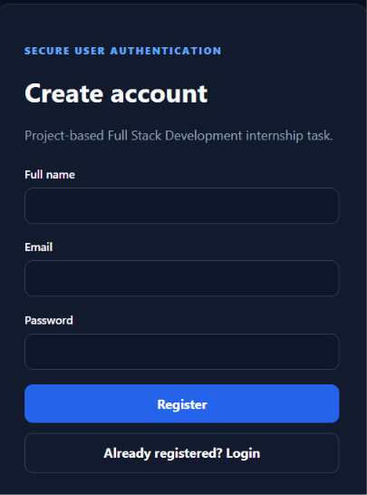
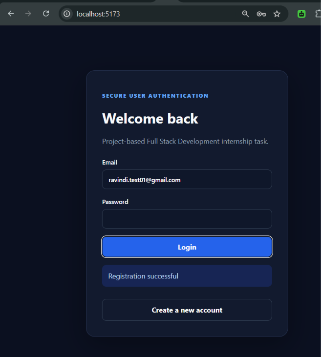
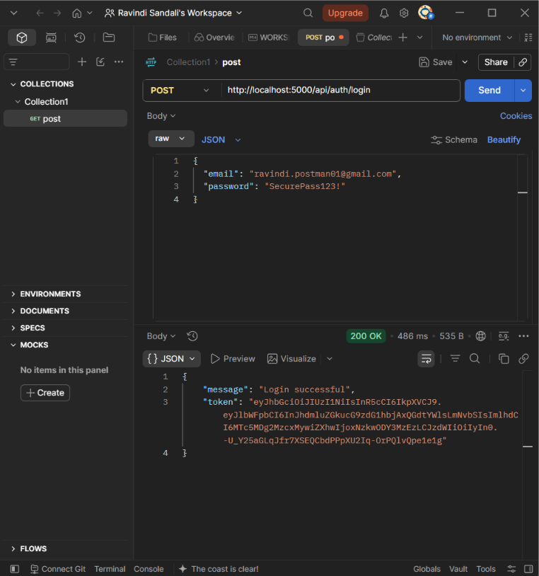
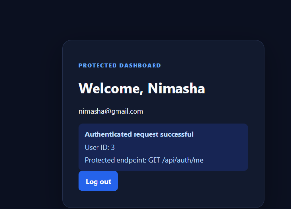
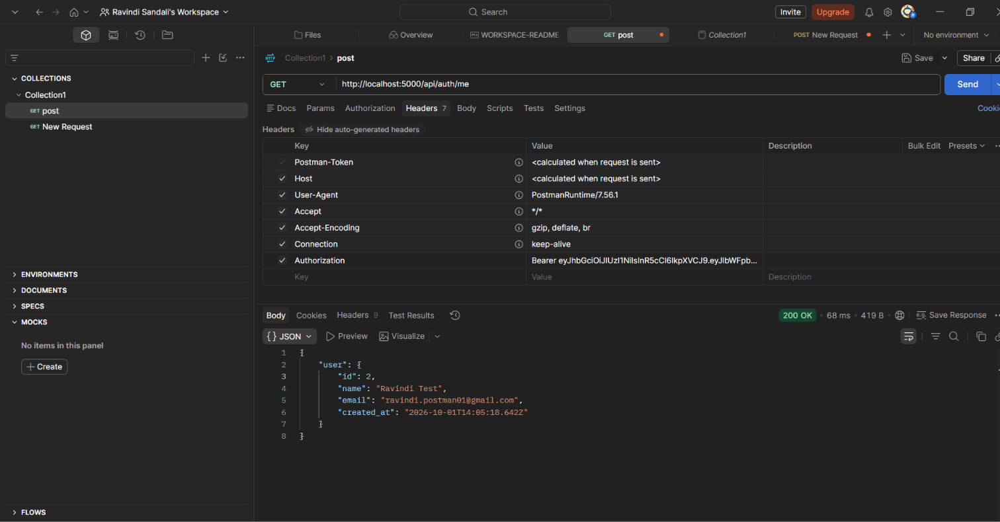
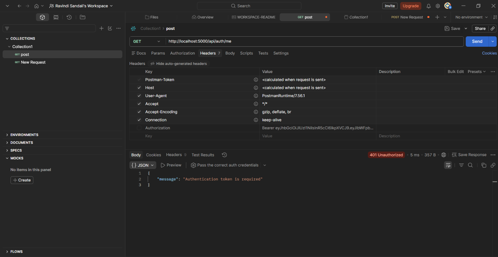
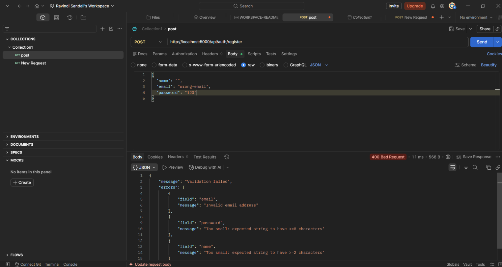
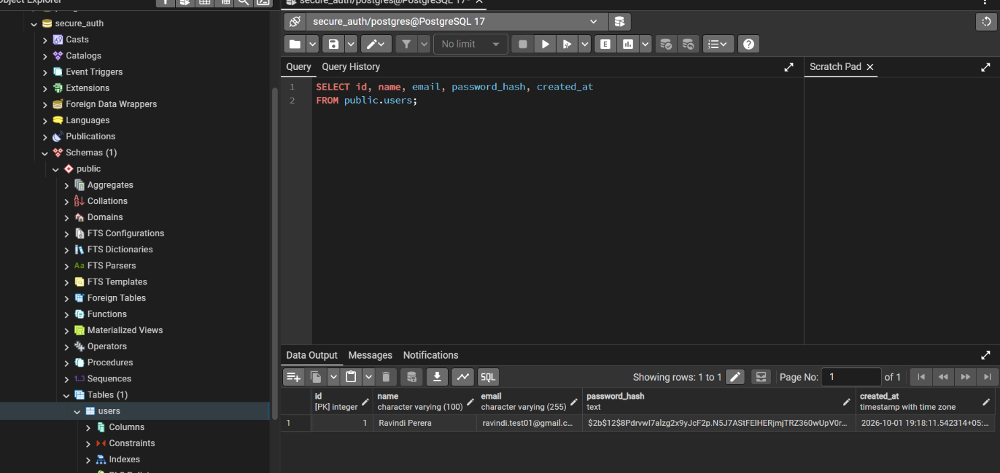

# Secure User Authentication

Full Stack Development internship project implementing registration, login, bcrypt password hashing, JWT authentication, a protected endpoint, server-side validation, PostgreSQL persistence, and a React frontend.

## Stack
- Node.js + Express + TypeScript
- PostgreSQL + pg
- bcryptjs + jsonwebtoken + Zod
- React + TypeScript + Vite + Axios

## System Architecture

The application follows a client-server architecture:

```text
React + TypeScript
        |
      REST API
        |
Node.js + Express + TypeScript
        |
   JWT Authentication
        |
      bcrypt
        |
    PostgreSQL
```

## Authentication Flow

1. User submits registration details.
2. Server validates the input.
3. Password is hashed using bcrypt.
4. User data is stored in PostgreSQL.
5. User logs in using email and password.
6. Server verifies the password hash.
7. Server generates a JWT.
8. Client sends the JWT as a Bearer token.
9. Protected endpoints validate the token before returning data.

    
## Setup

### Database
Create a PostgreSQL database named `secure_auth`, then run `database/schema.sql`.

### Backend
```bash
cd backend
npm install
```
Copy `.env.example` to `.env` and set your PostgreSQL URL and a strong JWT secret.

```bash
npm run dev
```

API: `http://localhost:5000`

### Frontend
In another terminal:
```bash
cd frontend
npm install
npm run dev
```

Frontend: `http://localhost:5173`

## API
| Method | Endpoint | Auth |
|---|---|---|
| POST | `/api/auth/register` | No |
| POST | `/api/auth/login` | No |
| GET | `/api/auth/me` | Bearer JWT |

### Register
```json
{
  "name": "Jane Doe",
  "email": "user@example.com",
  "password": "StrongPassword123!"
}
```

### Login
```json
{
 "email": "user@example.com",
  "password": "StrongPassword123!"
}
```

Use the returned token:
```http
Authorization: Bearer JWT_TOKEN
```

### Protected request
`GET /api/auth/me`

## Security
- Passwords are hashed with bcrypt and never stored as plain text.
- JWT secrets are stored in environment variables.
- `.env` is not committed.
- Server-side input validation is implemented.
- Protected routes reject missing/invalid/expired tokens.

## HTTP status codes
`200 OK`, `201 Created`, `400 Bad Request`, `401 Unauthorized`, `409 Conflict`, `404 Not Found`, `500 Internal Server Error`.

## Screenshots

### Registration


### Registration Success


### Login Success


### Protected Dashboard


### Authenticated Protected Endpoint


### Unauthorized Request


### Validation Error


### Password Hashing


## Internship deliverables
- [x] Registration
- [x] Login
- [x] Password hashing
- [x] JWT authentication
- [x] Protected endpoint
- [x] Input validation
- [x] Proper HTTP status codes
- [ ] Public GitHub repository
- [ ] Live deployment
- [ ] Final screenshots/demo
